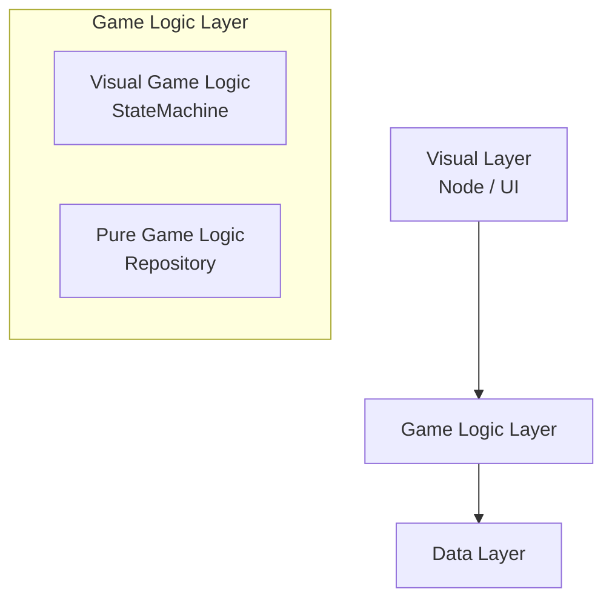
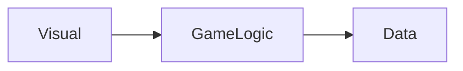
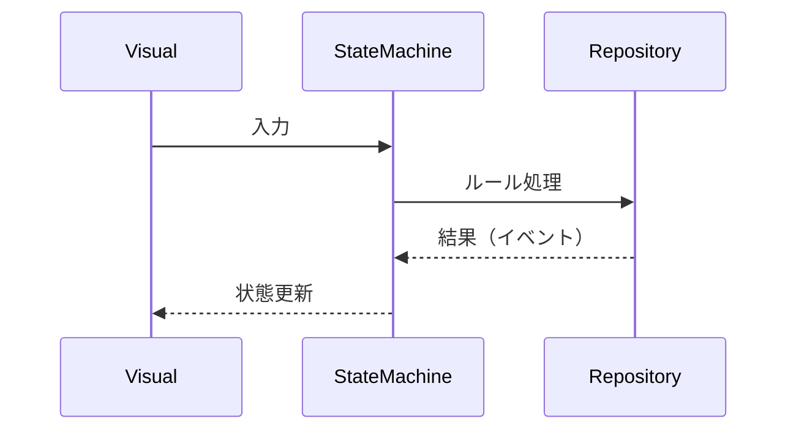
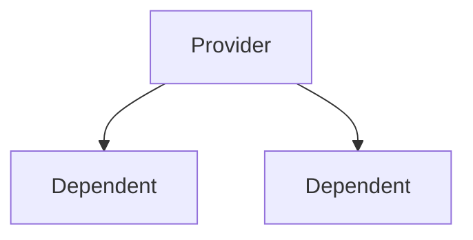

# CLAUDE.md

このファイルは、リポジトリのコードを操作する際にClaude Code（claude.ai/code）へ提供するガイダンスです。

## プロジェクト概要

EternalJourneyは **Godot 4.3.0（バージョン固定）** と **C#（.NET 8.0）** で開発された放置型オートシューティングゲームです。[Chickensoft](https://chickensoft.games/) エコシステムを多用しています。

設計判断・コードレビュー時は `docs/ARCHITECTURE_REFERENCE.md`（Chickensoft GameDemo流アーキテクチャ・リファレンス）を正とします。現状の準拠状況と改善事項は `docs/PROJECT_REVIEW.md` を参照してください。

## ビルドコマンド

```bash
# ビルド（NuGetパッケージのインストールも行われる）
dotnet build
```

Godot 4.3.0（.NET版）のインストールが必要です。VSCodeからデバッグする場合は、環境変数 `GODOT` にGodot実行ファイルのパスを設定してください。

## アーキテクチャ概要

### Chickensoft エコシステム

プロジェクトは3つのChickensoftライブラリを中心に構成されています。

**1. AutoInject（`[Meta(typeof(IAutoNode))]`）** — DIフレームワーク。ノードの初期化を4段階に分割します。

| メソッド           | タイミング                         | 用途                                                       |
| -------------- | ----------------------------- | -------------------------------------------------------- |
| `Initialize()` | シーンツリー追加前                     | 外部依存を使わない初期化（定数設定・ファイルロード・ユーティリティのインスタンス化）               |
| `OnReady()`    | シーンツリー追加後（≈ Godotの`_Ready()`） | ノードへのアクセス（`GetNode()` など）                                |
| `Setup()`      | DI解決前                         | 構造の準備（プロパティ初期値・LogicBlock / StateMachine の生成 ※DIには依存しない） |
| `OnResolved()` | DI解決後                         | 依存関係の使用（ステートのバインド・イベント購読・サービス呼び出し）                       |

補足
* `Setup()` は「DI未解決」のため、Injectされた依存は使用不可
* テスト環境での `Setup()` 実行はケース依存（必ずスキップされるわけではない）


全ノードで以下のオーバーライドが必須です: `public override void _Notification(int what) => this.Notify(what);`

**2. LogicBlocks** — ステートマシンフレームワーク。各エンティティの振る舞いは `LogicBlock` で管理されます。
- ステートは抽象レコード `State` の内部にネストされたレコードとして定義
- ステートは `IGet<Input.X>` を実装して入力を処理する
- ステート遷移は `To<NewState>()` または `ToSelf()` を返す
- Outputはバインディングを通じて親ノードで処理される
- `[LogicBlock(typeof(State), Diagram = true)]` により `.g.puml` PlantUMLダイアグラムが自動生成される（手動編集不可）

**3. GodotNodeInterfaces** — Godotノードのインターフェースラッパー（例: `INode2D`、`IVisibleOnScreenNotifier2D`）。テスト時のモック化を可能にします。

### GodotNodeInterfaces 使用方法

Godot の C# ノード用インターフェース集。
ライフサイクルや通知処理を **型安全かつ分離された形で扱えるようにする**ためのユーティリティです。

Godotの `_Ready()` や `_Process()` などのコールバックは継承ベースで override 必須のため分離しづらいですが、GodotNodeInterfaces を使うとインターフェースで分離でき、テストが容易になります。

#### 主なインターフェース

**ライフサイクル**

| インターフェース | 対応 |
|---|---|
| `IReady` | `_Ready()` |
| `IProcess` | `_Process()` |
| `IPhysicsProcess` | `_PhysicsProcess()` |

**通知系**

| インターフェース | 説明 |
|---|---|
| `INotification` | 任意通知の受信 |
| `IEnterTree` | ツリー追加時 |
| `IExitTree` | ツリー離脱時 |

#### 使用方法

① `_Notification()` を必ず override する（これがないと動作しない）:
```csharp
public override void _Notification(int what) => this.Notify(what);
```

② インターフェースを実装する:
```csharp
public partial class Player : Node2D, IReady, IProcess {
  public override void _Notification(int what) => this.Notify(what);

  public void OnReady() {
    GD.Print("Ready!");
  }

  public void OnProcess(double delta) {
    GD.Print($"Frame: {delta}");
  }
}
```

#### 使用例：プレイヤー制御

```csharp
public partial class Player : CharacterBody2D, IReady, IPhysicsProcess {
  public override void _Notification(int what) => this.Notify(what);

  private float _speed = 200;

  public void OnReady() {
    GD.Print("Player initialized");
  }

  public void OnPhysicsProcess(double delta) {
    var velocity = Velocity;
    if (Input.IsActionPressed("ui_right"))      velocity.X = _speed;
    else if (Input.IsActionPressed("ui_left"))  velocity.X = -_speed;
    else                                        velocity.X = 0;
    Velocity = velocity;
    MoveAndSlide();
  }
}
```

#### AutoInject との組み合わせ

```csharp
[Meta(typeof(IAutoNode))]
public partial class Player : Node2D, IReady, IProcess {
  public override void _Notification(int what) => this.Notify(what);

  public void OnReady() {
    GD.Print("AutoInject + NodeInterfaces");
  }

  public void OnProcess(double delta) {
    // フレーム処理
  }
}
```

> AutoInject は `this.Notify(what)` の呼び出しを前提に動作します。

### AutoInject 使用方法

#### 1. Provider（依存の提供）

```csharp
[Meta(typeof(IAutoNode))]
public partial class GameServiceProvider : Node, IProvide<GameService> {
  public override void _Notification(int what) => this.Notify(what);

  private GameService _service;

  public void Initialize() {
    _service = new GameService();
  }

  GameService IProvide<GameService>.Value() => _service;

  public void OnReady() {
    this.Provide();  // 子ノードへの提供を開始
  }
}
```

#### 2. Dependent（依存の受け取り）

```csharp
[Meta(typeof(IAutoNode))]
public partial class Player : Node {
  public override void _Notification(int what) => this.Notify(what);

  [Dependency] public GameService GameService => this.DependOn<GameService>();

  public void OnResolved() {
    GD.Print("DI解決完了");
    // ここから GameService が使用可能
  }
}
```

#### 3. シーン構造

```
Root
 ├─ GameServiceProvider   ← Provider は親または上位ノードに配置
 └─ Player
```

#### 4. LogicBlocksとの組み合わせ

```csharp
public void Setup() {
  // DI未解決のため、依存には触れない
  Logic = new FooLogic();
  LogicBinding = Logic.Bind();
}

public void OnResolved() {
  // DI解決済み — 依存を渡してバインド開始
  Logic.Set(GameService);
  LogicBinding.Start();
}
```

> **重要**: `Provide()` を呼ばないと子への注入が行われない。Provider は必ずツリー上の上位に配置する。

### 依存性注入パターン

```csharp
// 子ノードへの提供（親ノード）
public interface IMyNode : IProvide<IMyService> { }
IMyService IProvide<IMyService>.Value() => _service;

// 親ノードから取得（子ノード）
[Dependency] public IMyService MyService => this.DependOn<IMyService>();

// シーンツリーの名前規則で子ノードを検索
[Node] public IChildNode Child { get; set; } = default!;
```

### LogicBlocksパターン

#### 🧩 使用例：プレイヤーの状態管理（Idle / Running / Jumping）

**入力（Input）の定義**
```csharp
using Chickensoft.LogicBlocks;

// 入力（イベント）
public abstract record Input;
public record Run : Input;
public record Stop : Input;
public record Jump : Input;
public record Land : Input;
```

**ステートの定義**
```csharp
public record Idle : State {
  public override Transition On(Input input) => input switch {
    Run => To<Running>(),
    Jump => To<Jumping>(),
    _ => Stay()
  };
}

public record Running : State {
  public override void OnEnter() { /* 走り始めた */ }
  public override void OnExit()  { /* 走るのをやめた */ }
  public override Transition On(Input input) => input switch {
    Stop => To<Idle>(),
    Jump => To<Jumping>(),
    _ => Stay()
  };
}

public record Jumping : State {
  public override Transition On(Input input) => input switch {
    Land => To<Idle>(),
    _ => Stay()
  };
}
```

**階層ステート（共通処理の共有）**
```csharp
// 「地上にいる」共通ステート
public record Grounded : State {
  public override Transition On(Input input) => input switch {
    Jump => To<Jumping>(),
    _ => Stay()
  };
}
public record Idle : Grounded { }
public record Running : Grounded { }
```

#### プロジェクトでの実際の書き方（Input/Output を record struct で定義）

```csharp
[Meta, LogicBlock(typeof(State), Diagram = true)]
public partial class FooLogic : LogicBlock<FooLogic.State>
{
    public override Transition GetInitialState() => To<State.Idle>();

    public static class Input {
        public readonly record struct DoThing(float Value);
    }
    public static class Output {
        public readonly record struct ThingDone(float Result);
    }

    public abstract record State : StateLogic<State> {
        public record Idle : State, IGet<Input.DoThing> {
            public Transition On(in Input.DoThing input) {
                Output(new Output.ThingDone(input.Value));
                return To<Active>();
            }
        }
        public record Active : State { /* ... */ }
    }
}
```

**親ノードでのバインディング（`OnResolved()` 内）**
```csharp
LogicBinding = Logic.Bind();
LogicBinding
    .When<FooLogic.State.Active>(state => { /* ステート進入時 */ })
    .Handle((in FooLogic.Output.ThingDone o) => { /* Output処理 */ })
    .Start();
```

`OnTreeExiting` で必ず `LogicBinding.Dispose()` と `Logic.Dispose()` を呼ぶこと。

### ノードクラステンプレート

```csharp
public interface IFoo : INode2D { }

[Meta(typeof(IAutoNode))]
public partial class Foo : Node2D, IFoo
{
    public override void _Notification(int what) => this.Notify(what);

    #region Signals
    #endregion Signals
    #region State
    #endregion State
    #region Exports
    #endregion Exports
    #region Nodes
    #endregion Nodes
    #region Provisions
    #endregion Provisions
    #region Dependencies
    #endregion Dependencies

    public void Initialize() { }
    public void OnReady() { }
    public void Setup() { }
    public void OnResolved() { }
}
```

### 主要システム

- **`src/cores/`** — インフラ層: モデル/DTO、設定ファイルリーダー（`data/masters/` のCSV/JSON）、定数、ユーティリティ
- **`src/common/`** — 共通基底クラス（`BaseBullet`、`BaseEnemy`）、トレイト、状態異常システム
- **`src/app/`** — アプリ全体のステートマシン（`AppLogic`）: Splash → Menu → Game のシーン遷移
- **`src/battle/`** — バトルドメインのコア; `IBattleRepo` がダメージ・耐久データの主要DI提供元
- **オブジェクトプール** — 弾・敵はプール管理。`IPoolable`（`OnAcquired()` / `OnReleased()`）を実装する
- **ストラテジーパターン** — 弾の移動・衝突挙動はJSON設定で切り替え（`data/masters/` から読み込み）

### ステートマシンの配置場所

`src/` 配下の各エンティティフォルダは次の規則に従います: `src/{entity}/state/{Name}Logic.cs`

抽象基底クラスを持つエンティティ（weapon / bullet / bullet_factory）のみ `src/{entity}/abstract/state/{Name}Logic.cs` に配置します。

### コーディング規約

- 文字コード: UTF-8、改行文字: LF
- [Godot C#スタイルガイド](https://docs.godotengine.org/en/stable/tutorials/scripting/c_sharp/c_sharp_style_guide.html) に準拠
- コメントは日本語で記述する
- `.g.puml` ファイルはLogicBlocksが自動生成するため手動編集しないこと

## 全体アーキテクチャ

### レイヤー構成



---

### ① Visual Layer（見た目）

* Godot Node / Unity Component
* 入力処理・描画
* 状態の表示

**ロジックは持たせない**

---

### ② Game Logic Layer（ゲームの本体）

**A. Visual Game Logic**

* StateMachine（LogicBlocks）
* 各ノード専用ロジック
* 振る舞いの制御

**B. Pure Game Logic（ドメイン）**

* Repository
* ゲームルール
* 複数オブジェクトにまたがる処理

例：

* スコア管理
* 勝敗判定
* アイテム管理

**ゲームのルールはここに集約**

---

### ③ Data Layer

* セーブデータ
* 通信
* 外部API

---

## 依存ルール（最重要）



* 上 → 下のみ依存OK
* 横断・逆依存は禁止

**依存方向を守ることが設計のコア**

---

## データフロー



**イベント駆動（リアクティブ）**

---

## ステートマシンの役割

* 状態管理の中心
* Visualを操作する側

Visualは「受動的な表示層」

---

## DI（AutoInject）構造



* 親ノードが依存を提供
* 子ノードが受け取る

**解決の流れ:**

1. Provider が `Provide()` 呼び出し
2. 子ノードが依存を取得
3. `OnResolved()` 実行

**問題と解決:**

* 問題：Godotは子が先にReadyされる
* 解決：AutoInjectが解決タイミングを制御

**DIの順序問題を吸収**

---

## テスト戦略

> **すべて単体テスト可能にする**

**Two-Phase Initialization:**

```text
Setup()      = 構造を作る
OnResolved() = 依存を使う
```

テストで差し替え可能になる

**推奨構成（Feature単位）:**

```text
player/
enemy/
coin/
```

**疎結合設計:**

```csharp
public interface ICoinRepository { }
```

インターフェース経由で依存

---

## 設計のコア原則

* Visualにロジックを書かない
* 状態はStateMachineで管理
* ルールはRepositoryに集約
* 依存は一方向のみ
* イベントで疎結合
* テスト可能にする

---

## 全体イメージ

```mermaid
graph TD
  Node[Node (View)] --> SM[StateMachine]
  SM --> Repo[Repository]

  Repo -->|Event| SM
  SM -->|Update| Node
```

**「表示・状態・ルール」を完全に分離する設計**

```text
Node（見た目）
  ↓
StateMachine（振る舞い）
  ↓
Repository（ルール）
```

## レスポンス用メモ

* 常に日本語で返答する

### 出力文字数制限

* 基本的に200〜400文字程度
* 必要な場合のみ詳細な説明
* 例や補足は要求時のみ
* 冗長な導入は不要

### コード出力ルール

* 修正部分のみ出力
* ファイル全体の出力は禁止（明示要求時を除く）
* diff形式を優先
* 既存コードを繰り返さない

### 説明スタイル

* 順序：結論 → 理由 → 最小例
* 比喩や物語は使わない

### 不要な繰り返し禁止

* ユーザー質問の再言はしない
* 定型文も使わない

### 仮定しない

* 不明点は一行で確認
* 不足情報を補うことはしない
