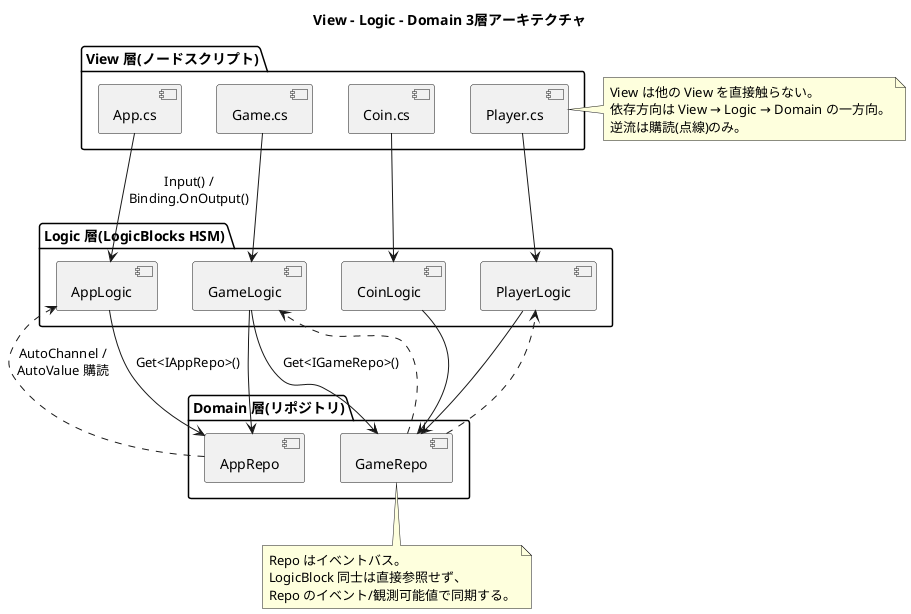
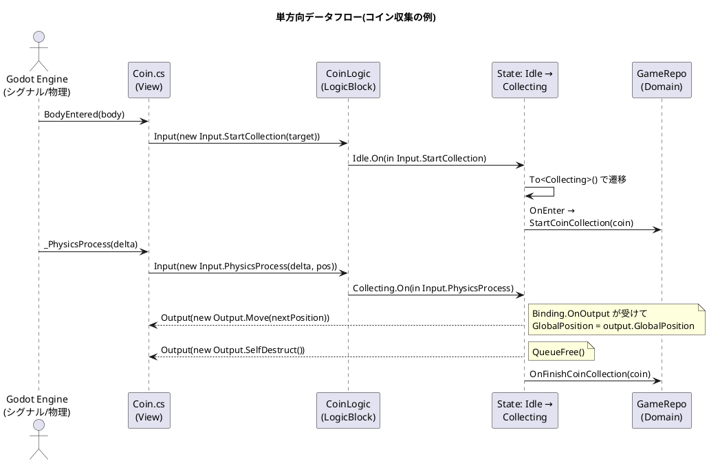
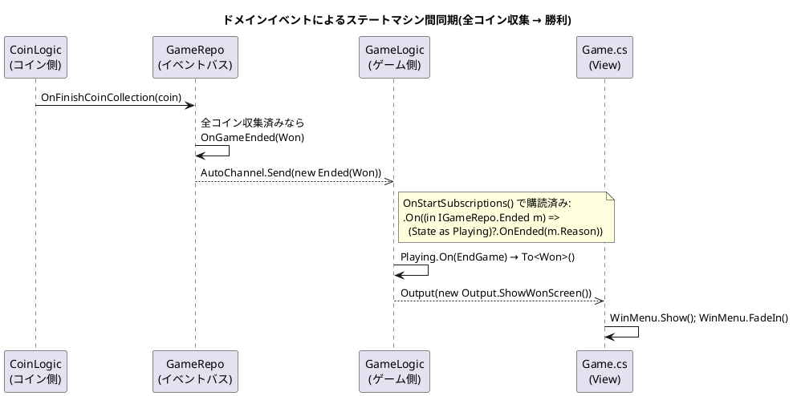
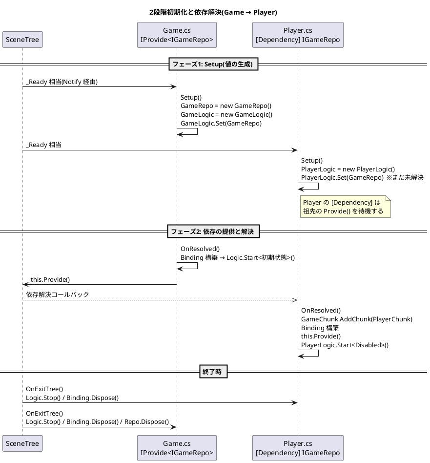
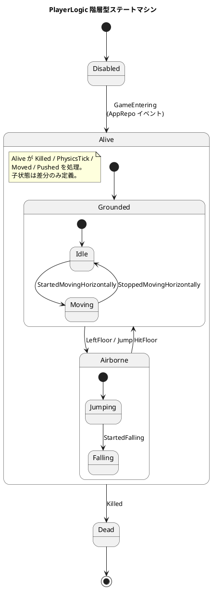
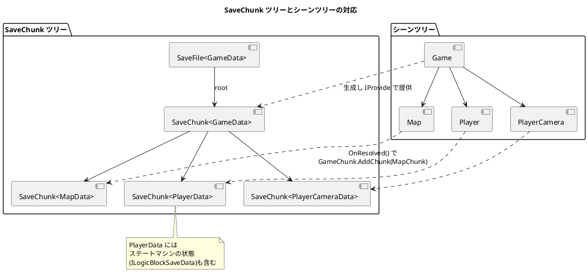

# Chickensoft流 ゲームアーキテクチャ・リファレンス

> **目的**: GameDemo と同じ品質・同じアーキテクチャで別プロジェクトを立ち上げ、進められるようにするための実践リファレンス。
> **出典**: [Chickensoft GameDemo](https://github.com/chickensoft-games/GameDemo)(Godot 4.x + .NET 8 + C#)の実コードに基づく。
> 図はすべて PlantUML 形式。コード例は LogicBlocks 6.x / AutoInject 2.x の実 API に準拠。

---

## 目次

1. [概要と適用範囲](#1-概要と適用範囲)
2. [アーキテクチャ全体図](#2-アーキテクチャ全体図)
3. [ディレクトリテンプレート](#3-ディレクトリテンプレート)
4. [データフロー](#4-データフロー)
5. [初期化ライフサイクルとDI](#5-初期化ライフサイクルとdi)
6. [状態機械設計ガイド](#6-状態機械設計ガイド)
7. [新機能追加の完全な一例(Gem)](#7-新機能追加の完全な一例gem)
8. [セーブシステム](#8-セーブシステム)
9. [命名規約・スタイル早見表](#9-命名規約スタイル早見表)
10. [テスト戦略](#10-テスト戦略)
11. [ツール・CI チェックリスト](#11-ツールci-チェックリスト)
12. [コードレビューチェックリスト](#12-コードレビューチェックリスト)

---

## 1. 概要と適用範囲

### 前提スタック

| 項目 | 内容 |
| --- | --- |
| エンジン | Godot 4.x(C#/.NET 対応ビルド) |
| ランタイム | .NET 8(`Nullable=enable`, `ImplicitUsings=disable`) |
| 状態管理 | Chickensoft.LogicBlocks(階層型ステートマシン) |
| DI | Chickensoft.AutoInject(シーンツリーベース) |
| リアクティブ | Chickensoft.Sync(`AutoValue<T>` / `AutoChannel`) |
| セーブ | Chickensoft.Serialization + SaveFileBuilder |
| テスト | Chickensoft.GoDotTest + GodotNodeInterfaces + Moq + Shouldly |

### 核となる設計原則(移植時に守るべきこと)

1. **View–Logic–Domain の3層分離** — ノードスクリプト(View)は表示と入出力の転送のみ。判断はすべて LogicBlock(Logic)へ。複数の LogicBlock で共有するロジック・状態は Repo(Domain)へ。
2. **フラグ変数を持たず、状態を列挙する** — 「ロード中」「セーブ中」「ポーズ中」はすべてステートマシンの状態として表現する。bool の組み合わせで状態空間を作らない。
3. **単方向データフロー** — `Input → 状態遷移/Output → View反映`。View から状態を直接書き換える経路を作らない。
4. **すべてにインターフェース** — ノード・Logic・Repo は必ず `I` プレフィックスのインターフェースを持ち、依存は常にインターフェース型で受ける(モック可能性のため)。
5. **一貫性 > 簡潔さ** — ボイラープレートはテスト可能性の代償として受容する。表示しかしないノードにも LogicBlock を作ってよい。「ロジックがあるなら LogicBlock を見ればよい」という予測可能性を守る。

---

## 2. アーキテクチャ全体図



### 各層の責務

| 層 | 実体 | 持つもの | 持たないもの |
| --- | --- | --- | --- |
| View | `Node` 派生 + `[Meta(typeof(IAutoNode))]` | シグナル受信、`Logic.Input()` 転送、`OnOutput` での表示更新、Godot API 呼び出し | 条件分岐によるゲームルール、状態フラグ |
| Logic | `AutoBlock` 派生 + 状態 record 群 | 状態遷移、ゲームルール、`Output()` 発行、Repo 呼び出し | Godot ノード操作(インターフェース経由の読み取りは可) |
| Domain | POCO(`IDisposable`) | 横断的な状態(`AutoValue`)、ドメインイベント(`AutoChannel`)、純粋ロジック | シーンツリーへの参照、View の知識 |

---

## 3. ディレクトリテンプレート

機能(フィーチャー)単位でシーン・スクリプト・アセット・状態機械を同居させる。**テストは `test/src/` に同一パスでミラー**する。

```text
project/
├── src/
│   ├── Main.cs                # エントリポイント(テスト実行判定 → App.tscn へ)
│   ├── Main.tscn
│   ├── app/                   # アプリ全体の状態(スプラッシュ→メニュー→ゲーム)
│   │   ├── App.tscn
│   │   ├── App.cs                     # View
│   │   ├── AppLogic.cs                # LogicBlock 本体(購読定義)
│   │   ├── AppLogic.Data.cs           # ブラックボードデータ
│   │   ├── domain/
│   │   │   └── AppRepo.cs             # ドメインリポジトリ
│   │   └── state/
│   │       ├── AppLogicState.cs        # 抽象基底 state
│   │       ├── AppLogicState.Input.cs  # 入力メッセージ定義
│   │       ├── AppLogicState.Output.cs # 出力メッセージ定義
│   │       └── states/                 # 1状態1ファイル
│   │           ├── SplashScreen.cs
│   │           ├── MainMenu.cs
│   │           └── InGame.cs
│   ├── game/                  # ゲームセッション(Playing/Paused/Won/Lost...)
│   ├── player/                # プレイヤー(HSM の代表例)
│   ├── <feature>/             # 機能ごとに追加(coin, jumpshroom, map...)
│   │   ├── Feature.tscn
│   │   ├── Feature.cs
│   │   ├── FeatureData.cs             # セーブデータ(必要な場合)
│   │   ├── FeatureLogic.cs
│   │   ├── FeatureLogic.Data.cs
│   │   └── state/...
│   ├── traits/                # 能力インターフェース(IKillable 等)
│   └── utils/                 # 小さなユーティリティ(Instantiator 等)
├── test/
│   └── src/                   # src/ を完全ミラー。<対象>Test.cs
├── docs/                      # 画像・ドキュメント(.gdignore で Godot から隠す)
├── badges/                    # カバレッジバッジ(.gdignore)
├── .editorconfig              # Chickensoft スタイル(全ルール warning)
├── CodeAnalyzers.ruleset      # 遅いアナライザのみ無効化
├── GameDemo.csproj            # テスト条件付き参照を含む
├── global.json                # .NET SDK + Godot.NET.Sdk バージョン固定
├── coverage.ps1 / coverage.sh # カバレッジ収集スクリプト
└── .github/workflows/         # CI(実 Godot テスト・spellcheck・version PR)
```

### 構成のポイント

- namespace はフォルダ構造と一致させなくてよい(全型を単一 namespace に置く。`dotnet_style_namespace_match_folder = false`)。
- 入れ子 partial 型はドット区切りファイル名で分割する: `PlayerLogic.State.Alive.Airborne.Falling.cs`。
- フォルダ名は Godot 慣習の `snake_case`、C# ファイル名は型名に合わせ `PascalCase`。

---

## 4. データフロー

### 4.1 基本フロー: 入力 → 状態遷移 → 表示反映



### 4.2 Repo イベントバスによる横断同期



### 4.3 データフローのルール

- View → Logic は `Input`(`readonly record struct`)のみ。
- Logic → View は `Output`(`readonly record struct`)のみ。ハンドラは `(in Output.X output) => ...`。
- Logic 同士は直接参照しない。Repo の `AutoChannel`(イベント)/ `AutoValue<T>`(観測可能値)を介す。
- 購読時は「現在の状態にだけ届ける」安全キャストを使う: `(State as Playing)?.OnEnded(...)`。

---

## 5. 初期化ライフサイクルとDI

AutoInject の 2 段階初期化。**祖先が `IProvide<T>` + `this.Provide()`、子孫が `[Dependency]` + `this.DependOn<T>()`**。シーンツリーの構造がそのまま DI コンテナになる。



### View の定型構造(必ずこの形にする)

```csharp
namespace MyGame;

using Chickensoft.AutoInject;
using Chickensoft.GodotNodeInterfaces;
using Chickensoft.Introspection;
using Chickensoft.LogicBlocks;
using Godot;

public interface IMyFeature : INode3D;

[Meta(typeof(IAutoNode))]
public partial class MyFeature : Node3D, IMyFeature
{
  // AutoInject のライフサイクルを有効化する1行(全ノード共通)
  public override void _Notification(int what) => this.Notify(what);

  #region Nodes
  // 子ノードはインターフェース型 + [Node] で受ける(テストでフェイク可能)
  [Node("%AnimationPlayer")] public IAnimationPlayer AnimationPlayer { get; set; } = default!;
  #endregion Nodes

  #region Dependencies
  [Dependency] public IGameRepo GameRepo => this.DependOn<IGameRepo>();
  #endregion Dependencies

  #region State
  public IMyFeatureLogic Logic { get; set; } = default!;
  public LogicBlock.Binding Binding { get; set; } = default!;
  #endregion State

  // フェーズ1: 自分が使う値を生成する(テスト時はスキップされ、フェイクが入る)
  public void Setup()
  {
    Logic = new MyFeatureLogic();
    Logic.Set(GameRepo);
  }

  // フェーズ2: 依存解決後。Binding 構築 → Provide → Start の順
  public void OnResolved()
  {
    Binding = Logic.Bind();
    Binding.OnOutput((in MyFeatureLogicState.Output.DoSomething _) => { /* 表示更新 */ });
    Logic.Start<MyFeatureLogicState.Idle>();
  }

  // 後始末: 購読解除 → Stop → Dispose(自分が生成したものだけ)
  public void OnExitTree()
  {
    Logic.Stop();
    Binding.Dispose();
  }
}
```

### ライフサイクルメソッドの使い分け

| メソッド | タイミング | やること |
| --- | --- | --- |
| `Setup()` | `_Ready` 相当・依存解決前 | 自分が所有するオブジェクトの生成。テスト時はスキップされる |
| `OnReady()` | `_Ready` 相当 | Godot 固有の初期化(`SetPhysicsProcess(true)` 等) |
| `OnResolved()` | `[Dependency]` がすべて解決した後 | Binding 構築、SaveChunk 登録、`this.Provide()`、`Logic.Start<T>()` |
| `OnPhysicsProcess(double)` | 物理ティック | `Logic.Input(new Input.PhysicsTick(delta))` の転送のみ |
| `OnExitTree()` | ツリー離脱時 | イベント購読解除、`Logic.Stop()`、`Binding.Dispose()`、所有 Repo の `Dispose()` |

---

## 6. 状態機械設計ガイド

### 6.1 階層型ステートマシン(HSM)の設計

共通の振る舞いは親状態に置き、子状態は差分だけを定義する。GameDemo の Player が代表例:



### 6.2 状態クラスの書き方ルール

- **1状態1ファイル**。ファイル名は入れ子構造をドットで表現。
- 状態は `partial record`、`[Meta]` を付与(セーブ対象なら `[Meta, Id("...")]`)。
- 処理できる入力を `IGet<Input.X>` で宣言し、`public Type On(in Input.X input)` で遷移先の型を返す。
  - 遷移: `To<NextState>()` / 自己遷移: `ToSelf()`
- 副作用は `this.OnEnter(...)` / `this.OnExit(...)` と `Output(...)` に限定する。
- 依存はブラックボードから取得: `Get<IGameRepo>()`, `Get<MyLogic.Data>()`, `Get<MyLogic.Settings>()`。
- 状態内から入力を投げ直してよい: `Input(new Input.HitFloor(...))`(物理判定 → 論理イベント変換のパターン)。
- switch 式は必ず網羅し、`_ =>` フォールバックを付ける(未知の enum 値もテストする)。

```csharp
namespace MyGame;

using System;
using Chickensoft.Introspection;
using Chickensoft.LogicBlocks;

public partial record MyFeatureLogicState
{
  [Meta]
  public partial record Active : MyFeatureLogicState, IGet<Input.Deactivated>
  {
    public Active()
    {
      this.OnEnter(() => Output(new Output.PlayActivateEffect()));
    }

    public Type On(in Input.Deactivated input) => To<Inactive>();
  }
}
```

### 6.3 パフォーマンス規約(ゲーム特有)

- LogicBlock のコンストラクタで `Preallocate<TState>()` を呼び、状態インスタンスを事前確保する(実行中の GC 回避)。
- `Input` / `Output` は `readonly record struct` にし、ハンドラは `in` 引数で受ける(ボックス化・コピー回避)。
- ホットパスの小さな述語には `[MethodImpl(MethodImplOptions.AggressiveInlining)]` を検討する。

---

## 7. 新機能追加の完全な一例(Gem)

「プレイヤーが触れると吸い寄せられて消える宝石(Gem)」を追加する場合の**最小フルセット**。GameDemo の Coin 実装(実コード)をベースにしたテンプレート。

### 7.1 追加するファイル一覧

```text
src/gem/
├── Gem.tscn
├── Gem.cs                          # View
├── GemLogic.cs                     # LogicBlock 本体 + セーブデータ定義
├── GemLogic.Data.cs                # ブラックボードデータ
└── state/
    ├── GemLogicState.cs            # 抽象基底
    ├── GemLogicState.Input.cs
    ├── GemLogicState.Output.cs
    └── states/
        ├── GemLogic.State.Idle.cs
        └── GemLogic.State.Collecting.cs
test/src/gem/
├── GemTest.cs                      # View テスト
└── state/states/
    ├── GemLogic.State.IdleTest.cs
    └── GemLogic.State.CollectingTest.cs
```

### 7.2 LogicBlock 本体 — `GemLogic.cs`

```csharp
namespace MyGame;

using Chickensoft.Introspection;
using Chickensoft.LogicBlocks;
using Chickensoft.LogicBlocks.Auto;
using Chickensoft.Serialization;

public interface IGemLogic : IAutoLogicBlock;

[Meta, Id("gem_logic")]
public partial class GemLogic : AutoBlock, IGemLogic
{
  public GemLogic()
  {
    Preallocate<GemLogicState>();
  }

  // 状態から Get<GemLogic.Settings>() で参照する不変設定
  public record Settings(double CollectionTimeInSeconds);

  // ステートマシン自体をセーブ可能にする(セーブ不要な機能なら省略可)
  public override ILogicBlockSaveData Serialize(LogicBlockData data) =>
    new GemLogicSaveData { Data = data };
}

[Meta, Id("gem_logic_save_data")]
public partial class GemLogicSaveData : ILogicBlockSaveData
{
  [Save("data")]
  public required LogicBlockData Data { get; init; }
}
```

### 7.3 ブラックボードデータ — `GemLogic.Data.cs`

```csharp
namespace MyGame;

using Chickensoft.Introspection;
using Chickensoft.Serialization;

public partial class GemLogic
{
  [Meta, Id("gem_logic_data")]
  public partial class Data
  {
    /// <summary>Id of the entity that is collecting us, if any.</summary>
    [Save("target")]
    public string? Target { get; set; }

    [Save("elapsed_time")]
    public double ElapsedTime { get; set; }
  }
}
```

### 7.4 状態の基底と Input/Output — `state/`

```csharp
// GemLogicState.cs — [StateDiagram] で puml 図が自動生成される
namespace MyGame;

using Chickensoft.Introspection;
using Chickensoft.LogicBlocks;

[Meta, StateDiagram]
public abstract partial record GemLogicState : LogicBlockState;
```

```csharp
// GemLogicState.Input.cs
namespace MyGame;

using Godot;

public abstract partial record GemLogicState
{
  public static class Input
  {
    public readonly record struct StartCollection(ICoinCollector Target);
    public readonly record struct PhysicsProcess(
      double Delta, Vector3 GlobalPosition
    );
  }
}
```

```csharp
// GemLogicState.Output.cs
namespace MyGame;

using Godot;

public abstract partial record GemLogicState
{
  public static class Output
  {
    public readonly record struct Move(Vector3 GlobalPosition);
    public readonly record struct SelfDestruct();
  }
}
```

### 7.5 各状態 — `state/states/`

```csharp
// GemLogic.State.Idle.cs
namespace MyGame;

using System;
using Chickensoft.Introspection;
using Chickensoft.LogicBlocks;

public partial record GemLogicState
{
  [Meta, Id("gem_logic_state_idle")]
  public partial record Idle : GemLogicState, IGet<Input.StartCollection>
  {
    public Type On(in Input.StartCollection input)
    {
      Get<GemLogic.Data>().Target = input.Target.Name;
      return To<Collecting>();
    }
  }
}
```

```csharp
// GemLogic.State.Collecting.cs
namespace MyGame;

using System;
using Chickensoft.Collections;
using Chickensoft.Introspection;
using Chickensoft.LogicBlocks;

public partial record GemLogicState
{
  [Meta, Id("gem_logic_state_collecting")]
  public partial record Collecting : GemLogicState, IGet<Input.PhysicsProcess>
  {
    public Collecting()
    {
      // 副作用は OnEnter に集約。ドメインへの通知もここから。
      // ※ IGameRepo に対応するメソッド(StartGemCollection 等)を追加すること。
      this.OnEnter(() => Get<IGameRepo>().StartGemCollection(Get<IGem>()));
    }

    public Type On(in Input.PhysicsProcess input)
    {
      var settings = Get<GemLogic.Settings>();
      var data = Get<GemLogic.Data>();
      var entityTable = Get<EntityTable>();

      data.ElapsedTime += input.Delta;

      if (data.ElapsedTime >= settings.CollectionTimeInSeconds)
      {
        Output(new Output.SelfDestruct());
      }

      // EntityTable で id → エンティティ参照を復元(セーブ復帰後も安全)
      if (entityTable.Get<ICoinCollector>(data.Target) is { } target)
      {
        var nextPosition = input.GlobalPosition.Lerp(
          target.CenterOfMass,
          (float)(data.ElapsedTime / settings.CollectionTimeInSeconds)
        );
        Output(new Output.Move(nextPosition));
      }

      return ToSelf();
    }
  }
}
```

### 7.6 View — `Gem.cs`

```csharp
namespace MyGame;

using Chickensoft.AutoInject;
using Chickensoft.Collections;
using Chickensoft.GodotNodeInterfaces;
using Chickensoft.Introspection;
using Chickensoft.LogicBlocks;
using Godot;

public interface IGem : INode3D
{
  IGemLogic GemLogic { get; }
}

[Meta(typeof(IAutoNode))]
public partial class Gem : Node3D, IGem
{
  public override void _Notification(int what) => this.Notify(what);

  #region Nodes
  [Node("%AnimationPlayer")] public IAnimationPlayer AnimationPlayer { get; set; } = default!;
  #endregion Nodes

  #region Exports
  public double CollectionTimeInSeconds { get; set; } = 1.0f;
  #endregion Exports

  #region State
  [Dependency] public EntityTable EntityTable => this.DependOn<EntityTable>();
  [Dependency] public IGameRepo GameRepo => this.DependOn<IGameRepo>();

  public IGemLogic GemLogic { get; set; } = default!;
  public GemLogic.Settings Settings { get; set; } = default!;
  public LogicBlock.Binding GemBinding { get; set; } = default!;
  #endregion State

  public void Setup()
  {
    Settings = new GemLogic.Settings(CollectionTimeInSeconds);
    GemLogic = new GemLogic();

    GemLogic.Set(this as IGem);
    GemLogic.Set(Settings);
    GemLogic.Set(GameRepo);
    GemLogic.Save(() => new GemLogic.Data());
    GemLogic.Set(EntityTable);
  }

  public void OnResolved()
  {
    EntityTable.Set(Name, this);
    GemBinding = GemLogic.Bind();

    GemBinding
      .OnState<GemLogicState.Collecting>(_ =>
      {
        SetPhysicsProcess(true);
        AnimationPlayer.Play("collect");
      })
      .OnOutput((in GemLogicState.Output.Move output) =>
        GlobalPosition = output.GlobalPosition)
      .OnOutput((in GemLogicState.Output.SelfDestruct _) => QueueFree());

    GemLogic.Start<GemLogicState.Idle>();
  }

  public void OnPhysicsProcess(double delta) =>
    GemLogic.Input(new GemLogicState.Input.PhysicsProcess(delta, GlobalPosition));

  public void OnCollectorBodyEntered(Node body)
  {
    if (body is ICoinCollector target)
    {
      GemLogic.Input(new GemLogicState.Input.StartCollection(target));
    }
  }

  public void OnExitTree()
  {
    GemLogic.Stop();
    GemBinding.Dispose();
    EntityTable.Remove(Name);
  }
}
```

### 7.7 チェック: 新機能追加の手順まとめ

1. `src/<feature>/` を作り、View / Logic / Data / State(Input/Output/states)を上記テンプレートで揃える
2. 依存(Repo・EntityTable 等)は `[Dependency]` で受け、`Setup()` で `Logic.Set(...)` する
3. セーブ対象なら `[Meta, Id]` + `[Save]` を付け、親の SaveChunk に登録する(→ §8)
4. `test/src/<feature>/` に View テストと状態テストを同時に追加する(→ §10)
5. `dotnet build` で警告ゼロを確認(全スタイルルールが warning になっている)

---

## 8. セーブシステム

### 8.1 構造: SaveChunk ツリーがシーンツリーをミラーする



### 8.2 実装ルール

- **セーブデータは record** + `[Meta, Id("snake_case_id")]` + `[Save("snake_case_key")]`:

```csharp
[Meta, Id("player_data")]
public partial record PlayerData
{
  [Save("global_transform")]
  public required Transform3D GlobalTransform { get; init; }
  [Save("state_machine")]
  public required ILogicBlockSaveData StateMachine { get; init; }
  [Save("velocity")]
  public required Vector3 Velocity { get; init; }
}
```

- **ルートノード(Game)** が `SaveFile<GameData>` と root chunk を生成し、`JsonSerializerOptions` に `SerializableTypeConverter` / `SerializableTypeResolver` を設定。ファイル I/O は **`System.IO.Abstractions.IFileSystem` 経由**(テストでモックするため)。
- **各ノード**は `OnResolved()` で自分の chunk を親 chunk に登録:

```csharp
PlayerChunk = new SaveChunk<PlayerData>(
  onSave: (chunk) => new PlayerData()
  {
    GlobalTransform = GlobalTransform,
    StateMachine = PlayerLogic.GetSaveData(),  // ステートマシンごと保存
    Velocity = Velocity
  },
  onLoad: (chunk, data) =>
  {
    GlobalTransform = data.GlobalTransform;
    Velocity = data.Velocity;
    PlayerLogic.Stop();
    PlayerLogic.Start(data.StateMachine.Data); // 保存時の状態から再開
  }
);
GameChunk.AddChunk(PlayerChunk);
```

- **非同期セーブ中は入力をブロックする状態に遷移**する(`Paused.Saving` のように状態として表現)。完了は `Input(new Input.SaveCompleted())` で通知。
- ロードは専用状態(`LoadingSaveFile`)+ 完了シグナルで扱う。**ローディングフラグ変数を作らない**。
- セーブファイル欠如は正常系として扱う(ログ出力 + null 返却)。
- 動的エンティティの参照は `EntityTable`(名前 → エンティティ)で保存・復元する。

---

## 9. 命名規約・スタイル早見表

Microsoft 公式規約から**意図的に逸脱**している箇所があるので注意(.editorconfig に明記)。

| 対象 | 規約 | 例 |
| --- | --- | --- |
| 型・メソッド・プロパティ・公開フィールド | `PascalCase` | `PlayerLogic`, `OnResolved` |
| private フィールド | `_camelCase` | `_autoChannel`, `_disposedValue` |
| 定数 | `ALL_UPPER_SNAKE` | `GAME_SCENE_PATH`, `SAVE_FILE_NAME` |
| インターフェース | `I` プレフィックス必須(全ノード・Repo・Logic) | `IGameRepo`, `ICoin` |
| ジェネリック型引数 | `T` プレフィックス | `TState` |
| Input/Output メッセージ | `readonly record struct`、名は出来事/命令 | `Input.Jumped`, `Output.MovementComputed` |
| Repo の通知メソッド | `On<出来事>` / 設定系は `Set<値>` | `OnGameEnded`, `SetIsMouseCaptured` |
| セーブキー・型 Id | `snake_case` | `[Save("last_velocity")]`, `[Id("player_logic")]` |
| ファイル名 | 型名と一致。入れ子はドット区切り | `PlayerLogic.State.Alive.cs` |
| フォルダ名 | `snake_case`(Godot 慣習) | `in_game_ui/` |
| テストクラス | `<対象>Test`、`test/src/` にミラー配置 | `PlayingTest.cs` |

### スタイル・イディオム

- file-scoped namespace(`namespace MyGame;`)、`using` は **namespace の内側**、System を先頭にソート。
- インデント 2 スペース、80 桁ルーラー、LF、`var` 全面使用、1 行に収まるメンバは式形式(`=>`)。
- ブレース必須(1 行 if 禁止)。プライマリコンストラクタ禁止(ツール対応不良のため)。
- DI・ライフサイクルで後から必ず代入されるプロパティは `= default!` で宣言。
- `#region` は定型区分に限定: `Nodes` / `Exports` / `State` / `Save` / `Dependencies` / `Provisions` / `Internals`。
- コメントは「**なぜ**」を書く(バグ回避・設計判断の理由)。公開 API には単位付きの XML ドキュメントコメント(`/// <summary>Rotation speed (quaternions?/sec).</summary>`)。
- switch 式は網羅必須 + `_ =>` フォールバック。switch 文より switch 式を優先。

---

## 10. テスト戦略

**すべてのクラスに対応するテストを書く**(カバレッジバッジを README に掲示するのが Chickensoft 流)。テストは 2 種類に大別される。

### 10.1 状態テスト(純粋・高速)— `StateTester`

状態を単体で生成し、ブラックボードにモックを差して、入力 → 遷移/出力を検証する。

```csharp
namespace MyGame.Tests;

using Chickensoft.GoDotTest;
using Godot;
using Moq;
using Shouldly;

public class GemIdleTest : TestClass
{
  private StateTester _context = default!;
  private GemLogicState.Idle _state = default!;
  private GemLogic.Data _data = default!;

  public GemIdleTest(Node testScene) : base(testScene) { }

  [Setup]
  public void Setup()
  {
    _state = new GemLogicState.Idle();
    _context = _state.Test();          // StateTester を取得
    _data = new GemLogic.Data();
    _context.Set(_data);               // ブラックボードへ依存を注入
  }

  [Test]
  public void StartsCollectingOnStartCollection()
  {
    var target = new Mock<ICoinCollector>();
    target.Setup(t => t.Name).Returns((StringName)"Player");

    _state.On(new GemLogicState.Input.StartCollection(target.Object))
      .ShouldBe(typeof(GemLogicState.Collecting)); // 遷移先の型を検証

    _data.Target.ShouldBe("Player");
  }
}
```

検証ポイント:

- `_state.On(input)` の戻り値(遷移先 `Type`)を `ShouldBe(typeof(...))`
- `_state.Enter()` 後の `_context.Outputs` / `_context.Inputs` の中身
- モック Repo の `Verify(...)` でドメイン呼び出し

### 10.2 View テスト — フェイク注入 + `FakeBinding`

ノードを `new` して、`IsTesting = true` で `Setup()` をスキップし、全依存をフェイクに差し替える。

```csharp
[Setup]
public void Setup()
{
  _logic = new Mock<IGemLogic>();
  _binding = LogicBlock.CreateFakeBinding();
  _logic.Setup(logic => logic.Bind()).Returns(_binding);

  _gem = new Gem
  {
    AnimationPlayer = _animPlayer.Object,
    GemLogic = _logic.Object,
    GemBinding = _binding
  };

  (_gem as IAutoInit).IsTesting = true;       // Setup() フェーズをスキップ
  _gem.FakeDependency(_gameRepo.Object);       // [Dependency] をフェイク
  _gem.FakeNodeTree(new()                      // [Node] をフェイク
  {
    ["%AnimationPlayer"] = _animPlayer.Object
  });
}

[Test]
public void MovesOnMoveOutput()
{
  _gem.OnResolved();
  _binding.Output(new GemLogicState.Output.Move(Vector3.One)); // 出力を偽装
  _gem.GlobalPosition.ShouldBe(Vector3.One);
}
```

- 実シーンツリーが必要なテストのみ `GodotTestDriver` の `Fixture` で `await fixture.AddToRoot(node)`。
- 入力転送の検証は `_logic.Setup(l => l.Input(in It.Ref<Input.X>.IsAny))` + `VerifyAll()`。
- `Mock<IGameRepo>` の `AutoValue` プロパティは実物の `AutoValue<T>` を返し、`[Cleanup]` で `Dispose()` する。

### 10.3 テスト実行の仕組み

- エントリポイント `Main.cs` が `RUN_TESTS` define(Debug ビルドのみ)+ コマンドライン引数で判定し、GoDotTest を起動する。**同一バイナリでゲームもテストも動く**。
- リリースビルドでは csproj の条件で `test/**` のコンパイルとテスト用パッケージ参照が完全に除外される。

---

## 11. ツール・CI チェックリスト

新プロジェクト立ち上げ時に揃えるもの。[Chickensoft GodotGame テンプレート](https://github.com/chickensoft-games/GodotGame)から生成するのが最短。

### .editorconfig(コード品質の門番)

- [ ] Chickensoft EditorConfig をベースにする
- [ ] `dotnet_analyzer_diagnostic.severity = warning` — **全スタイルルールをデフォルト warning 化**
- [ ] ルールを無効化するときは必ず理由コメントを添える(既存の無効化例: プライマリコンストラクタ禁止、switch 文の網羅不要・switch 式は網羅必須)

### csproj

- [ ] `<Nullable>enable</Nullable>` / `<ImplicitUsings>disable</ImplicitUsings>`
- [ ] `<WarningsAsErrors>CS9057</WarningsAsErrors>`(ソースジェネレータのコンパイラ不整合を即エラー)
- [ ] `<EmitCompilerGeneratedFiles>true</EmitCompilerGeneratedFiles>` + `.generated/` で生成コードを可視化
- [ ] テスト依存は `RUN_TESTS` 条件付き `ItemGroup`、リリース時に `<Compile Remove="test/**/*.cs" />`
- [ ] `CodeAnalyzers.ruleset` で遅いアナライザ(RS1022, CA2252)のみ無効化
- [ ] `global.json` で .NET SDK と `Godot.NET.Sdk` のバージョンを固定

### CI(GitHub Actions)

- [ ] **実 Godot ランタイムでのテスト実行**: `xvfb-run godot --headless 相当 + --run-tests --quit-on-finish`、mesa エミュレーションドライバでレンダードライバを matrix 化
- [ ] スペルチェック(cspell + `cspell.json` の辞書管理)
- [ ] バージョン更新の workflow_dispatch → 自動 PR 生成
- [ ] renovate による依存自動更新(Godot バージョンは `global.json` を単一ソースにする)

### カバレッジ

- [ ] coverlet + reportgenerator(`coverage.ps1` / `coverage.sh`)
- [ ] バッジ SVG を `badges/` にコミットし README から参照
- [ ] 生成物ディレクトリ(`docs/`, `coverage/`, `badges/`)に `.gdignore` を置いて Godot から隠す

### エディタ

- [ ] VSCode: `formatOnSave` + `organizeImports` + `fixAll`、80 桁ルーラー
- [ ] launch.json にテストデバッグ用プロファイル(GoDotTest が VSCode デバッグに対応)

---

## 12. コードレビューチェックリスト

このアーキテクチャ基準でのレビュー観点(全項目がプロジェクト内の実例に基づく):

- [ ] **View にロジックがないか** — 条件分岐・ルール判定が View にあれば LogicBlock へ移す
- [ ] **新しい状態はセットが揃っているか** — 1状態1ファイル / `[Meta]`(セーブ対象なら `[Meta, Id]`)/ `IGet<>` 宣言 / 対応するテスト
- [ ] **依存の受け方** — 子ノードは `[Node]` + インターフェース型、祖先依存は `[Dependency]` + `IProvide` + `this.Provide()`
- [ ] **メッセージ型** — Input/Output は `readonly record struct`、ハンドラは `in` 引数
- [ ] **セーブ** — 対象データに `[Save]`/`[Id]` があるか、SaveChunk 登録は `OnResolved()` で行っているか、動的参照は `EntityTable` 経由か
- [ ] **後始末** — `OnExitTree()` でシグナル購読解除・`Logic.Stop()`・`Binding.Dispose()`・所有 Repo の `Dispose()` が揃っているか
- [ ] **命名** — 定数 `ALL_UPPER`、private `_camelCase`、インターフェース `I` プレフィックス
- [ ] **switch 式** — 網羅 + `_ =>` フォールバックがあるか(未知の enum 値のテストも)
- [ ] **状態 vs フラグ** — 新しい bool フラグが実は「状態」ではないか(ローディング・処理中は state にする)
- [ ] **Logic 間の直接参照がないか** — ステートマシン間の連携は Repo のイベント/観測可能値を経由しているか

---

## 付録: 最小限の Repo テンプレート

```csharp
namespace MyGame;

using System;
using Chickensoft.Sync.Primitives;

public interface IScoreRepo : IDisposable
{
  IAutoChannel AutoChannel { get; }

  /// <summary>Event invoked when a high score is reached.</summary>
  readonly record struct HighScoreReached(int Score);

  /// <summary>Current score.</summary>
  IAutoValue<int> Score { get; }

  void AddScore(int amount);
}

public class ScoreRepo : IScoreRepo
{
  private readonly AutoChannel _autoChannel = new();
  public IAutoChannel AutoChannel => _autoChannel;

  public IAutoValue<int> Score => _score;
  private readonly AutoValue<int> _score = new(0);

  private bool _disposedValue;

  public void AddScore(int amount)
  {
    _score.Value += amount;

    if (_score.Value >= 100)
    {
      _autoChannel.Send(new IScoreRepo.HighScoreReached(_score.Value));
    }
  }

  #region Internals

  protected void Dispose(bool disposing)
  {
    if (!_disposedValue)
    {
      if (disposing)
      {
        _score.Dispose();
        _autoChannel.Dispose();
      }

      _disposedValue = true;
    }
  }

  public void Dispose()
  {
    Dispose(disposing: true);
    GC.SuppressFinalize(this);
  }

  #endregion Internals
}
```

LogicBlock 側での購読(`OnStartSubscriptions()`):

```csharp
public override IEnumerable<IDisposable> OnStartSubscriptions()
{
  yield return Get<IScoreRepo>().AutoChannel.Bind()
    .On((in IScoreRepo.HighScoreReached message) =>
      (State as MyLogicState.Playing)?.OnHighScore(message.Score));
}
```
