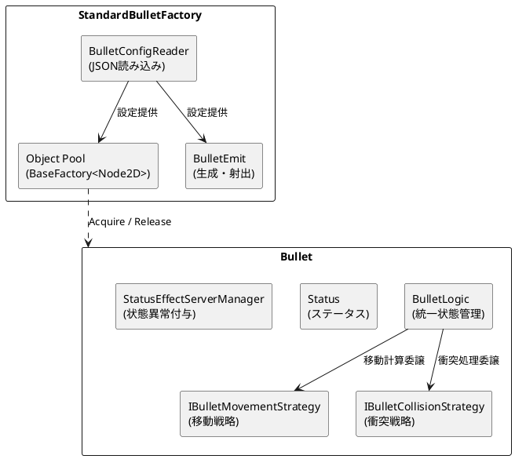
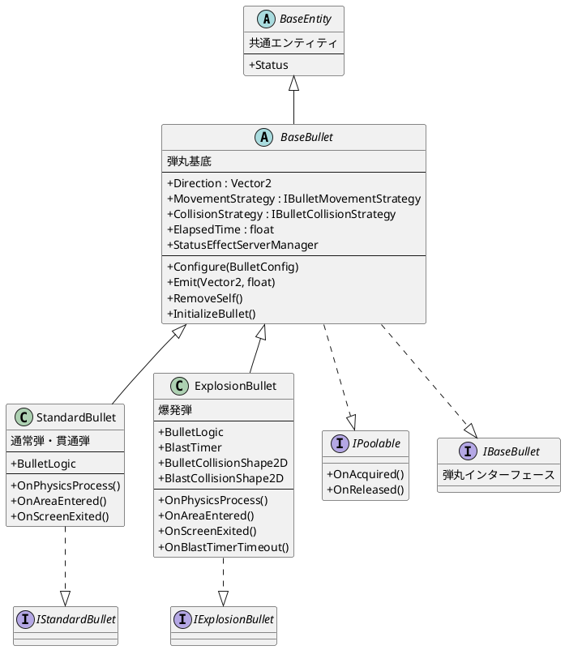
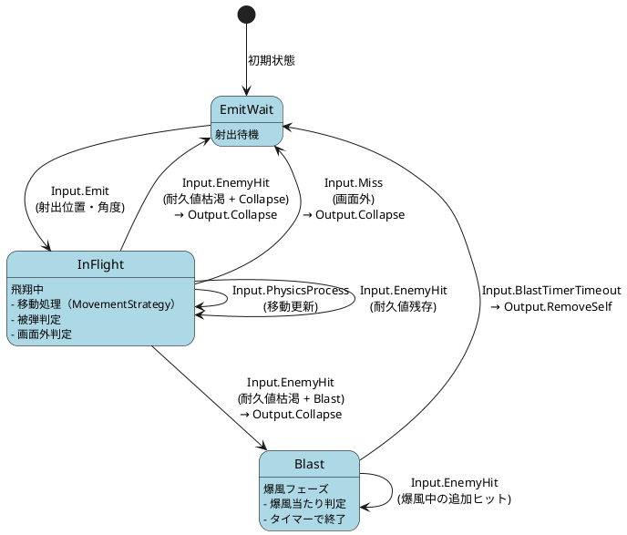
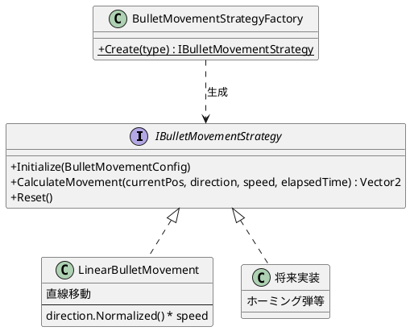
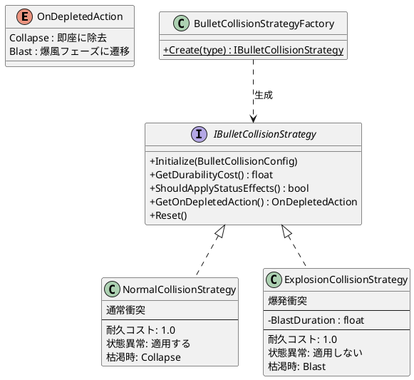

# Bullet Architecture Documentation

## 目次
1. [設計思想](#設計思想)
2. [アーキテクチャ図](#アーキテクチャ図)
3. [関連ファイル一覧](#関連ファイル一覧)
4. [弾丸の設定方法](#弾丸の設定方法)
5. [実装・改修ガイド](#実装改修ガイド)

---

## 設計思想

### 概要
弾丸システムは以下の設計原則に基づいて構築されています：

1. **データ駆動設計（Data-Driven Design）**
   - 弾丸の挙動はJSONファイルで定義
   - コードを変更せずに新しい弾丸タイプを追加可能
   - ゲームデザイナーが直接パラメータを調整可能

2. **ストラテジーパターン（Strategy Pattern）**
   - 移動パターンを`IBulletMovementStrategy`として抽象化
   - 衝突パターンを`IBulletCollisionStrategy`として抽象化
   - 実行時に戦略を切り替え可能、新しいパターンの追加が容易

3. **統一状態機械（Unified State Machine）**
   - `BulletLogic`がChickensoft LogicBlocksで全弾丸タイプの状態を統一管理
   - 通常弾と爆発弾で同一のロジックブロックを共有
   - 衝突ストラテジーの`GetOnDepletedAction()`で耐久値枯渇時の分岐（Collapse / Blast）を決定

4. **オブジェクトプーリング**
   - `StandardBulletFactory`（`BaseFactory<Node2D>`継承）でプール管理
   - GCの負荷を軽減し、パフォーマンスを最適化
   - `IPoolable`インターフェースでライフサイクル管理

5. **継承と合成のバランス**
   - `BaseBullet` → `StandardBullet` / `ExplosionBullet`の継承階層
   - 移動・衝突は合成（ストラテジーパターン）で実装
   - 共通機能は基底クラス、固有のノード制御は派生クラス

---

## アーキテクチャ図

### 全体構成



### クラス継承関係



### 状態遷移図（BulletLogic）



### 移動戦略（Strategy Pattern）



### 衝突戦略（Strategy Pattern）



---

## 関連ファイル一覧

### モデルクラス（設定データ構造）
| ファイル | パス | 説明 |
|----------|------|------|
| `BulletConfig.cs` | `src/cores/models/bullet/` | 弾丸設定のルートモデル |
| `BulletConfigRoot.cs` | `src/cores/models/bullet/` | JSONルート構造 |
| `BulletStatusConfig.cs` | `src/cores/models/bullet/` | ステータス設定 |
| `BulletStatusEffectConfig.cs` | `src/cores/models/bullet/` | 状態異常設定 |
| `BulletMovementConfig.cs` | `src/cores/models/bullet/` | 移動パターン設定 |
| `BulletCollisionConfig.cs` | `src/cores/models/bullet/` | 衝突パターン設定 |

### リポジトリ（データアクセス）
| ファイル | パス | 説明 |
|----------|------|------|
| `BaseJsonReader.cs` | `src/cores/repositories/base/` | JSON読み込み基底クラス |
| `BulletConfigReader.cs` | `src/cores/repositories/` | 弾丸設定リーダー |

### 弾丸本体
| ファイル | パス | 説明 |
|----------|------|------|
| `BaseBullet.cs` | `src/bullet/abstract/base/` | 弾丸基底クラス |
| `StandardBullet.cs` | `src/bullet/abstract/` | 通常弾・貫通弾実装 |
| `ExplosionBullet.cs` | `src/bullet/abstract/` | 爆発弾実装 |
| `BulletLogic.cs` | `src/bullet/abstract/state/` | 統一状態管理ロジック |

### 移動戦略
| ファイル | パス | 説明 |
|----------|------|------|
| `IBulletMovementStrategy.cs` | `src/bullet/strategies/movement/` | 移動戦略インターフェース |
| `BulletMovementStrategyFactory.cs` | `src/bullet/strategies/movement/` | 戦略ファクトリ |
| `LinearBulletMovement.cs` | `src/bullet/strategies/movement/` | 直線移動 |

### 衝突戦略
| ファイル | パス | 説明 |
|----------|------|------|
| `IBulletCollisionStrategy.cs` | `src/bullet/strategies/collision/` | 衝突戦略インターフェース（`OnDepletedAction`列挙体含む） |
| `BulletCollisionStrategyFactory.cs` | `src/bullet/strategies/collision/` | 戦略ファクトリ |
| `NormalCollisionStrategy.cs` | `src/bullet/strategies/collision/` | 通常衝突（Collapse） |
| `ExplosionCollisionStrategy.cs` | `src/bullet/strategies/collision/` | 爆発衝突（Blast） |

### ファクトリ
| ファイル | パス | 説明 |
|----------|------|------|
| `StandardBulletFactory.cs` | `src/bullet_factory/abstract/` | 弾丸生成・プール管理 |

### データファイル
| ファイル | パス | 説明 |
|----------|------|------|
| `BulletConfig.json` | `data/masters/` | 弾丸設定JSON |

### シーンファイル
| ファイル | パス | 説明 |
|----------|------|------|
| `BaseBullet.tscn` | `src/bullet/abstract/base/` | 弾丸基底シーン |
| `StandardBullet.tscn` | `src/bullet/abstract/` | 通常弾シーン |
| `ExplosionBullet.tscn` | `src/bullet/abstract/` | 爆発弾シーン |
| `01_NormalBullet.tscn` | `src/bullet/` | NormalBullet実体シーン |
| `02_PenetrateBullet.tscn` | `src/bullet/` | PenetrateBullet実体シーン |
| `03_ExplosionBullet.tscn` | `src/bullet/` | ExplosionBullet実体シーン |

---

## 弾丸の設定方法

### JSON構造

```json
{
  "bullets": [
    {
      "id": "unique_bullet_id",
      "name": "Bullet Display Name",
      "status": {
        "maxDur": 1.0,     // 最大耐久値（ヒット可能回数に影響）
        "atk": 2.0,        // 攻撃力
        "spd": 10.0,       // 移動速度
        "def": 0.0,        // 防御力
        "size": 1.0         // サイズ倍率
      },
      "statusEffects": [
        { "type": "poison", "enabled": true }
      ],
      "movement": {
        "type": "linear",   // 移動タイプ
        "params": {}         // タイプ固有パラメータ
      },
      "collision": {
        "type": "normal",    // 衝突タイプ
        "params": {}         // タイプ固有パラメータ
      }
    }
  ]
}
```

### 利用可能な移動タイプ

#### 1. `linear` - 直線移動
発射方向に向かって直線的に移動します。

```json
"movement": {
  "type": "linear",
  "params": {}
}
```

### 利用可能な衝突タイプ

#### 1. `normal` - 通常衝突
エネミーにヒットすると耐久値が減少し、ステータスエフェクトを適用します。耐久値が0になると即座に除去（Collapse）されます。

```json
"collision": {
  "type": "normal",
  "params": {}
}
```

#### 2. `explosion` - 爆発衝突
エネミーにヒットすると耐久値が減少しますが、ステータスエフェクトは適用しません。耐久値が0になると爆風フェーズ（Blast）に遷移し、一定時間範囲ダメージを与えます。

```json
"collision": {
  "type": "explosion",
  "params": {
    "blastDuration": 0.5   // 爆風持続時間（秒）
  }
}
```

### 既存の弾丸設定例

#### Normal Bullet（通常弾）
- 耐久値1（1ヒットで消滅）、毒効果付き
```json
{
  "id": "normal_bullet",
  "status": { "maxDur": 1.0, "atk": 2.0, "spd": 10.0 },
  "statusEffects": [{ "type": "poison", "enabled": true }],
  "movement": { "type": "linear", "params": {} },
  "collision": { "type": "normal", "params": {} }
}
```

#### Penetrate Bullet（貫通弾）
- 耐久値10（複数のエネミーを貫通）
```json
{
  "id": "penetrate_bullet",
  "status": { "maxDur": 10.0, "atk": 1.0, "spd": 5.0 },
  "statusEffects": [],
  "movement": { "type": "linear", "params": {} },
  "collision": { "type": "normal", "params": {} }
}
```

#### Explosion Bullet（爆発弾）
- 耐久値1で爆風に遷移、爆風持続0.5秒
```json
{
  "id": "explosion_bullet",
  "status": { "maxDur": 1.0, "atk": 4.0, "spd": 8.0 },
  "statusEffects": [],
  "movement": { "type": "linear", "params": {} },
  "collision": { "type": "explosion", "params": { "blastDuration": 0.5 } }
}
```

### 弾丸の射出方法

```csharp
// StandardBulletFactoryのBulletIdにJSON上のIDを設定（エディタのExport）
// ファクトリが自動でConfigを読み込み、弾丸に適用
bulletFactory.GenerateBullet();
```

---

## 実装・改修ガイド

### 新しい弾丸タイプをJSONに追加する

1. `data/masters/BulletConfig.json`を開く
2. `bullets`配列に新しいエントリを追加

```json
{
  "id": "rapid_bullet",
  "name": "Rapid Bullet",
  "status": {
    "maxDur": 1.0,
    "atk": 0.5,
    "spd": 20.0,
    "def": 0.0,
    "size": 0.5
  },
  "statusEffects": [],
  "movement": {
    "type": "linear",
    "params": {}
  },
  "collision": {
    "type": "normal",
    "params": {}
  }
}
```

### 新しい移動パターンを追加する

#### 手順1: 戦略クラスを作成

`src/bullet/strategies/movement/`に新しいクラスを作成：

```csharp
namespace EternalJourney.Bullet.Strategies.Movement;

using EternalJourney.Cores.Models.Bullet;
using Godot;

/// <summary>
/// サインウェーブ移動（蛇行しながら飛翔）
/// </summary>
public class SineWaveBulletMovement : IBulletMovementStrategy
{
    private float _amplitude = 50.0f;
    private float _frequency = 2.0f;

    public void Initialize(BulletMovementConfig config)
    {
        if (config.Params.TryGetValue("amplitude", out float amp))
        {
            _amplitude = amp;
        }
        if (config.Params.TryGetValue("frequency", out float freq))
        {
            _frequency = freq;
        }
    }

    public Vector2 CalculateMovement(
        Vector2 currentPosition,
        Vector2 direction,
        float speed,
        float elapsedTime)
    {
        Vector2 forward = direction.Normalized() * speed;
        Vector2 perpendicular = new Vector2(-forward.Y, forward.X).Normalized();
        float wave = Mathf.Cos(elapsedTime * _frequency * Mathf.Tau) * _amplitude;
        return forward + perpendicular * wave;
    }

    public void Reset()
    {
    }
}
```

#### 手順2: ファクトリに登録

`BulletMovementStrategyFactory.cs`を編集：

```csharp
private static readonly Dictionary<string, Func<IBulletMovementStrategy>> _strategies = new()
{
    { "linear", () => new LinearBulletMovement() },
    { "sine_wave", () => new SineWaveBulletMovement() }  // 追加
};
```

#### 手順3: JSONで使用

```json
"movement": {
  "type": "sine_wave",
  "params": {
    "amplitude": 30.0,
    "frequency": 3.0
  }
}
```

### 新しい衝突パターンを追加する

#### 手順1: 戦略クラスを作成

`src/bullet/strategies/collision/`に新しいクラスを作成：

```csharp
namespace EternalJourney.Bullet.Strategies.Collision;

using EternalJourney.Cores.Models.Bullet;

/// <summary>
/// バウンス衝突（ヒット時に消滅せず跳ね返る）
/// </summary>
public class BounceCollisionStrategy : IBulletCollisionStrategy
{
    public void Initialize(BulletCollisionConfig config)
    {
    }

    public float GetDurabilityCost() => 0.0f;  // 耐久値を消費しない

    public bool ShouldApplyStatusEffects() => true;

    public OnDepletedAction GetOnDepletedAction() => OnDepletedAction.Collapse;

    public void Reset()
    {
    }
}
```

#### 手順2: ファクトリに登録

`BulletCollisionStrategyFactory.cs`を編集：

```csharp
private static readonly Dictionary<string, Func<IBulletCollisionStrategy>> _strategies = new()
{
    { "normal", () => new NormalCollisionStrategy() },
    { "explosion", () => new ExplosionCollisionStrategy() },
    { "bounce", () => new BounceCollisionStrategy() }  // 追加
};
```

#### 手順3: JSONで使用

```json
"collision": {
  "type": "bounce",
  "params": {}
}
```

### 新しい弾丸クラスを作成する（特殊ノード構成が必要な場合）

`ExplosionBullet`のように固有のシーンノード（爆風コリジョン等）を持つ場合は、`BaseBullet`を継承した新しいクラスを作成します：

```csharp
namespace EternalJourney.Bullet.Abstract;

using Chickensoft.AutoInject;
using Chickensoft.Introspection;
using EternalJourney.Bullet.Abstract.Base;
using EternalJourney.Bullet.Abstract.State;
using Godot;

[Meta(typeof(IAutoNode))]
public partial class LaserBullet : BaseBullet
{
    public override void _Notification(int what) => this.Notify(what);

    public BulletLogic BulletLogic { get; set; } = default!;
    public BulletLogic.IBinding BulletBinding { get; set; } = default!;

    // レーザー固有のノード
    [Node]
    public IRayCast2D LaserRay { get; set; } = default!;

    public override void Setup()
    {
        base.Setup();
        BulletLogic = new BulletLogic();
        BulletBinding = BulletLogic.Bind();
        BulletLogic.Set(this as IBaseBullet);
        // レーザー固有の初期化...
    }

    public override void Emit(Vector2 shotGlobalPosition, float shotGlobalAngle)
    {
        BulletLogic.Input(new BulletLogic.Input.Emit(shotGlobalPosition, shotGlobalAngle));
    }
}
```

---

## トラブルシューティング

### 弾丸が射出されない
1. `BulletConfig.json`のJSONフォーマットを確認
2. `StandardBulletFactory`の`BulletId`が存在するIDか確認
3. ファクトリの`BulletScene`が正しく設定されているか確認

### 移動・衝突パターンが適用されない
1. ファクトリクラス（`BulletMovementStrategyFactory` / `BulletCollisionStrategyFactory`）に登録されているか確認
2. `movement.type` / `collision.type`のスペルを確認
3. パラメータ名が正しいか確認（大文字小文字は区別される）

### 爆発弾の爆風が表示されない
1. `ExplosionBullet`シーンに`BlastCollisionShape2D`と`BlastColorRect`ノードが存在するか確認
2. `collision.type`が`"explosion"`に設定されているか確認
3. `blastDuration`パラメータが正の値か確認

### ビルドエラー
1. 新しいクラスの名前空間を確認
2. using文が正しいか確認
3. `dotnet build`でエラーメッセージを確認

---

## 関連ドキュメント

- [Enemy Architecture](EnemyArchitecture.md)
- [Chickensoft LogicBlocks](https://chickensoft.games/docs/logic_blocks/)
- [Chickensoft AutoInject](https://chickensoft.games/docs/auto_inject/)
- [Godot C# Documentation](https://docs.godotengine.org/en/stable/tutorials/scripting/c_sharp/)
