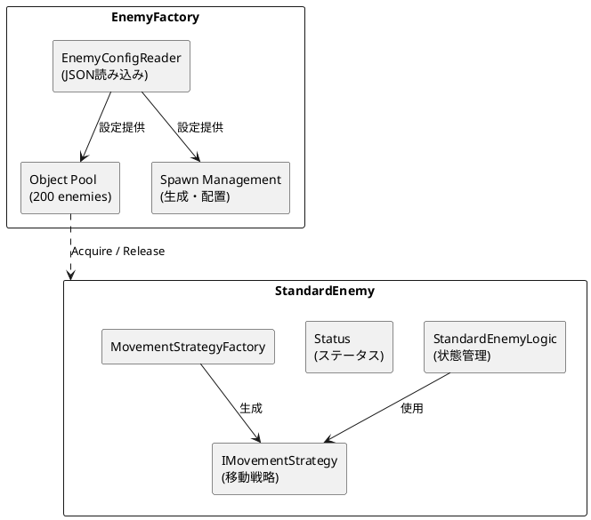
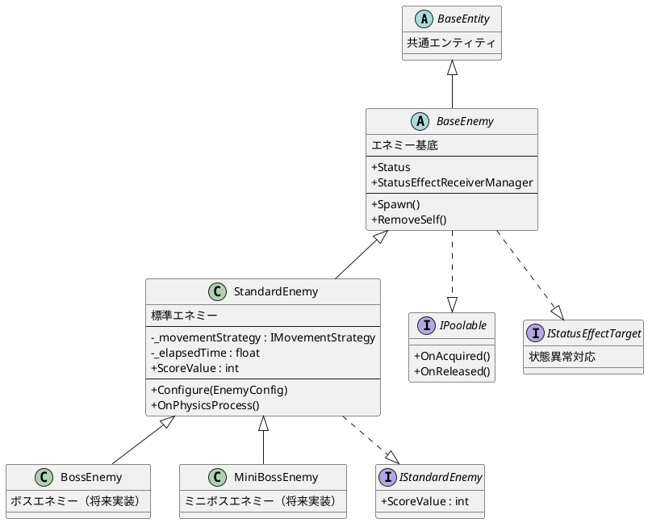
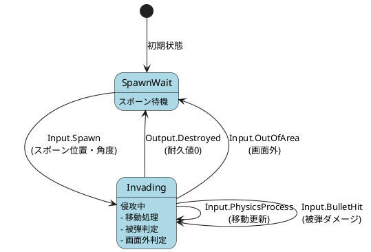
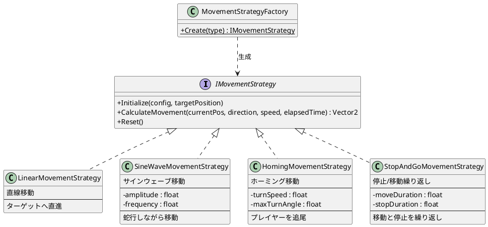

# Enemy Architecture Documentation

## 目次
1. [設計思想](#設計思想)
2. [アーキテクチャ図](#アーキテクチャ図)
3. [関連ファイル一覧](#関連ファイル一覧)
4. [エネミーの設定方法](#エネミーの設定方法)
5. [実装・改修ガイド](#実装改修ガイド)

---

## 設計思想

### 概要
エネミーシステムは以下の設計原則に基づいて構築されています：

1. **データ駆動設計（Data-Driven Design）**
   - エネミーの挙動はJSONファイルで定義
   - コードを変更せずに新しいエネミーを追加可能
   - ゲームデザイナーが直接パラメータを調整可能

2. **ストラテジーパターン（Strategy Pattern）**
   - 移動パターンを`IMovementStrategy`として抽象化
   - 実行時に移動戦略を切り替え可能
   - 新しい移動パターンの追加が容易

3. **状態機械（State Machine）**
   - `StandardEnemyLogic`がChickensoft LogicBlocksで状態管理
   - 状態遷移が明確で予測可能
   - 入力と出力を分離し、テスタビリティを向上

4. **オブジェクトプーリング**
   - `EnemyFactory`で200体のエネミーをプール管理
   - GCの負荷を軽減し、パフォーマンスを最適化
   - `IPoolable`インターフェースでライフサイクル管理

5. **継承と合成のバランス**
   - `BaseEnemy` → `StandardEnemy`の継承階層
   - 移動・攻撃は合成（ストラテジーパターン）で実装
   - 共通機能は基底クラス、固有機能は派生クラス

---

## アーキテクチャ図

### 全体構成



### クラス継承関係



### 状態遷移図



### 移動戦略（Strategy Pattern）



---

## 関連ファイル一覧

### モデルクラス（設定データ構造）
| ファイル | パス | 説明 |
|----------|------|------|
| `EnemyConfig.cs` | `src/cores/models/enemy/` | エネミー設定のルートモデル |
| `EnemyStatusConfig.cs` | `src/cores/models/enemy/` | ステータス設定 |
| `MovementConfig.cs` | `src/cores/models/enemy/` | 移動パターン設定 |
| `AttackConfig.cs` | `src/cores/models/enemy/` | 攻撃パターン設定（将来用） |
| `EnemyConfigRoot.cs` | `src/cores/models/enemy/` | JSONルート構造 |

### リポジトリ（データアクセス）
| ファイル | パス | 説明 |
|----------|------|------|
| `BaseJsonReader.cs` | `src/cores/repositories/base/` | JSON読み込み基底クラス |
| `EnemyConfigReader.cs` | `src/cores/repositories/` | エネミー設定リーダー |

### エネミー本体
| ファイル | パス | 説明 |
|----------|------|------|
| `BaseEnemy.cs` | `src/enemy/abstract/base/` | エネミー基底クラス |
| `StandardEnemy.cs` | `src/enemy/abstract/` | 標準エネミー実装 |
| `StandardEnemyLogic.cs` | `src/enemy/abstract/state/` | 状態管理ロジック |

### 移動戦略
| ファイル | パス | 説明 |
|----------|------|------|
| `IMovementStrategy.cs` | `src/enemy/strategies/movement/` | 移動戦略インターフェース |
| `MovementStrategyFactory.cs` | `src/enemy/strategies/movement/` | 戦略ファクトリ |
| `LinearMovementStrategy.cs` | `src/enemy/strategies/movement/` | 直線移動 |
| `SineWaveMovementStrategy.cs` | `src/enemy/strategies/movement/` | サインウェーブ移動 |
| `HomingMovementStrategy.cs` | `src/enemy/strategies/movement/` | ホーミング移動 |
| `StopAndGoMovementStrategy.cs` | `src/enemy/strategies/movement/` | 停止/移動繰り返し |

### ファクトリ
| ファイル | パス | 説明 |
|----------|------|------|
| `EnemyFactory.cs` | `src/enemy_factory/` | エネミー生成・プール管理 |

### データファイル
| ファイル | パス | 説明 |
|----------|------|------|
| `EnemyConfig.json` | `data/masters/` | エネミー設定JSON |

---

## エネミーの設定方法

### JSON構造

```json
{
  "enemies": [
    {
      "id": "unique_enemy_id",
      "name": "Enemy Display Name",
      "status": {
        "maxDur": 10.0,    // 最大耐久値
        "atk": 1.0,        // 攻撃力
        "spd": 0.7,        // 移動速度
        "def": 0.0,        // 防御力
        "size": 1.0        // サイズ倍率
      },
      "movement": {
        "type": "linear",  // 移動タイプ
        "params": {}       // タイプ固有パラメータ
      },
      "attack": {
        "type": "none",    // 攻撃タイプ（将来実装）
        "params": {}
      },
      "scoreValue": 10     // 撃破時のスコア
    }
  ]
}
```

### 利用可能な移動タイプ

#### 1. `linear` - 直線移動
ターゲットに向かって直線的に移動します。

```json
"movement": {
  "type": "linear",
  "params": {}
}
```

#### 2. `sine_wave` - サインウェーブ移動
蛇行しながら移動します。

```json
"movement": {
  "type": "sine_wave",
  "params": {
    "amplitude": 50.0,   // 振幅（横方向の揺れ幅）
    "frequency": 2.0     // 周波数（揺れの速さ）
  }
}
```

#### 3. `homing` - ホーミング移動
プレイヤーを追尾します。

```json
"movement": {
  "type": "homing",
  "params": {
    "turnSpeed": 1.5,     // 旋回速度
    "maxTurnAngle": 45.0  // 最大旋回角度
  }
}
```

#### 4. `stop_and_go` - 停止/移動の繰り返し
移動と停止を繰り返します。

```json
"movement": {
  "type": "stop_and_go",
  "params": {
    "moveDuration": 1.0,  // 移動時間（秒）
    "stopDuration": 0.5   // 停止時間（秒）
  }
}
```

### エネミーのスポーン方法

```csharp
// EnemyFactoryを取得後
enemyFactory.SpawnEnemy();                    // デフォルト（normal_enemy）
enemyFactory.SpawnEnemy("sine_enemy");        // IDを指定してスポーン
enemyFactory.SpawnEnemy("homing_enemy");
```

---

## 実装・改修ガイド

### 新しいエネミータイプをJSONに追加する

1. `data/masters/EnemyConfig.json`を開く
2. `enemies`配列に新しいエントリを追加

```json
{
  "id": "fast_enemy",
  "name": "Fast Enemy",
  "status": {
    "maxDur": 5.0,
    "atk": 0.5,
    "spd": 1.5,
    "def": 0.0,
    "size": 0.7
  },
  "movement": {
    "type": "linear",
    "params": {}
  },
  "attack": {
    "type": "none",
    "params": {}
  },
  "scoreValue": 15
}
```

### 新しい移動パターンを追加する

#### 手順1: 戦略クラスを作成

`src/enemy/strategies/movement/`に新しいクラスを作成：

```csharp
namespace EternalJourney.Enemy.Strategies.Movement;

using EternalJourney.Cores.Models.Enemy;
using Godot;

public class ZigZagMovementStrategy : IMovementStrategy
{
    private float _zigInterval = 1.0f;
    private float _zigAngle = 45.0f;

    public void Initialize(MovementConfig config, Vector2 targetPosition)
    {
        if (config.Params.TryGetValue("zigInterval", out float zi))
        {
            _zigInterval = zi;
        }
        if (config.Params.TryGetValue("zigAngle", out float za))
        {
            _zigAngle = za;
        }
    }

    public Vector2 CalculateMovement(
        Vector2 currentPosition,
        Vector2 direction,
        float speed,
        float elapsedTime)
    {
        // ジグザグ移動の計算ロジック
        int zigCount = (int)(elapsedTime / _zigInterval);
        float angle = (zigCount % 2 == 0) ? _zigAngle : -_zigAngle;
        Vector2 rotatedDir = direction.Normalized().Rotated(Mathf.DegToRad(angle));
        return rotatedDir * speed;
    }

    public void Reset()
    {
        // 必要に応じてリセット処理
    }
}
```

#### 手順2: ファクトリに登録

`MovementStrategyFactory.cs`を編集：

```csharp
private static readonly Dictionary<string, Func<IMovementStrategy>> _strategies = new()
{
    { "linear", () => new LinearMovementStrategy() },
    { "sine_wave", () => new SineWaveMovementStrategy() },
    { "homing", () => new HomingMovementStrategy() },
    { "stop_and_go", () => new StopAndGoMovementStrategy() },
    { "zigzag", () => new ZigZagMovementStrategy() }  // 追加
};
```

#### 手順3: JSONで使用

```json
"movement": {
  "type": "zigzag",
  "params": {
    "zigInterval": 0.5,
    "zigAngle": 30.0
  }
}
```

### StandardEnemyを継承した新しいエネミークラスを作成する

特殊な挙動が必要な場合：

```csharp
namespace EternalJourney.Enemy;

using Chickensoft.AutoInject;
using Chickensoft.Introspection;
using EternalJourney.Enemy.Abstract;
using Godot;

[Meta(typeof(IAutoNode))]
public partial class BossEnemy : StandardEnemy
{
    public override void _Notification(int what) => this.Notify(what);

    // ボス固有のフィールド
    private int _phase = 1;

    public override void Setup()
    {
        base.Setup();
        // ボス固有の初期化
    }

    // ボス固有のメソッド
    public void ChangePhase(int phase)
    {
        _phase = phase;
        // フェーズ変更ロジック
    }
}
```

### 攻撃パターンの実装（将来）

攻撃パターンは敵弾ファクトリ作成後に実装予定です。
実装時は移動戦略と同様のストラテジーパターンを使用：

```
src/enemy/strategies/attack/
├── IAttackStrategy.cs
├── AttackStrategyFactory.cs
├── NoAttackStrategy.cs
├── SingleShotStrategy.cs
├── SpreadShotStrategy.cs
└── AimedShotStrategy.cs
```

---

## トラブルシューティング

### エネミーがスポーンしない
1. `EnemyConfig.json`のJSONフォーマットを確認
2. 指定したIDが存在するか確認
3. `EnemyFactory`のプールサイズを確認

### 移動パターンが適用されない
1. `MovementStrategyFactory`に登録されているか確認
2. `movement.type`のスペルを確認
3. パラメータ名が正しいか確認（大文字小文字は区別される）

### ビルドエラー
1. 新しいクラスの名前空間を確認
2. using文が正しいか確認
3. `dotnet build`でエラーメッセージを確認

---

## 関連ドキュメント

- [Chickensoft LogicBlocks](https://chickensoft.games/docs/logic_blocks/)
- [Chickensoft AutoInject](https://chickensoft.games/docs/auto_inject/)
- [Godot C# Documentation](https://docs.godotengine.org/en/stable/tutorials/scripting/c_sharp/)
